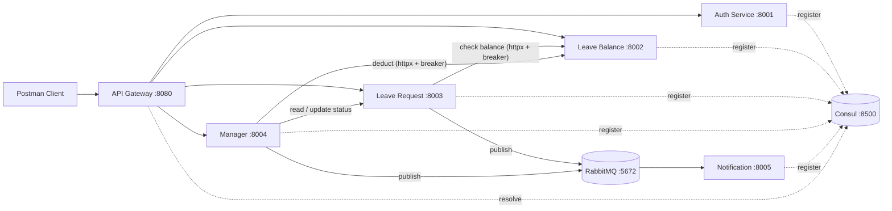
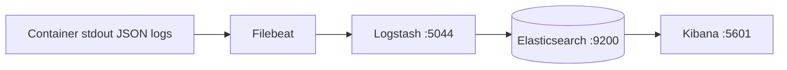

# Microservices Design Document

**Project:** Employee Leave Management System (ELMS)
**Stack:** Python 3.11 / FastAPI / Uvicorn / RabbitMQ / Consul / Docker Compose
**Version:** 1.0

---

## 1. Architecture overview

ELMS is a backend-only platform that lets employees apply for leave and lets
managers view, approve, or reject requests for their direct reports. It is
composed of **six application services** and **two infrastructure services**,
all on a single Docker network.

A single API gateway is the only ingress point. Behind it sit five domain
services that each own a slice of state and communicate either synchronously
over HTTP (for read/write operations that must complete before responding to
the user) or asynchronously over RabbitMQ (for fire-and-forget notification
events). Service-to-service discovery is brokered by Consul; the gateway
resolves downstream hosts through it on every forwarded request.

### 1.1 Architecture diagram

Optional ELK stack (enabled with `docker-compose --profile elk`):

### 1.2 Container topology

| Container                         | Image                                        | Port  | Profile  | Purpose                                |
| --------------------------------- | -------------------------------------------- | ----- | -------- | -------------------------------------- |
| `leave-mgmt-consul`               | `hashicorp/consul:1.18`                      | 8500  | default  | Service registry + UI                  |
| `leave-mgmt-rabbitmq`             | `rabbitmq:3-management`                      | 15672 | default  | Async event broker + UI                |
| `leave-mgmt-api-gateway`          | `elms-api-gateway`                           | 8080  | default  | Sole ingress, JWT validation, routing  |
| `leave-mgmt-auth-service`         | `elms-auth-service`                          | 8001  | default  | Login + JWT issuance                   |
| `leave-mgmt-leave-balance-service`| `elms-leave-balance-service`                 | 8002  | default  | Per-employee leave balances            |
| `leave-mgmt-leave-request-service`| `elms-leave-request-service`                 | 8003  | default  | Apply / history / cancel + validations |
| `leave-mgmt-manager-service`      | `elms-manager-service`                       | 8004  | default  | Team view + approve / reject           |
| `leave-mgmt-notification-service` | `elms-notification-service`                  | 8005  | default  | RabbitMQ consumer + templates          |
| `leave-mgmt-elasticsearch`        | `docker.elastic.co/.../elasticsearch:8.13.4` | 9200  | `elk`    | ELK: log store                         |
| `leave-mgmt-logstash`             | `docker.elastic.co/.../logstash:8.13.4`      | 5044  | `elk`    | ELK: log pipeline                      |
| `leave-mgmt-kibana`               | `docker.elastic.co/.../kibana:8.13.4`        | 5601  | `elk`    | ELK: log UI                            |
| `leave-mgmt-filebeat`             | `docker.elastic.co/.../filebeat:8.13.4`      | -     | `elk`    | ELK: log shipper                       |

Only the API gateway publishes a host port (`8080`); the others are reachable
only over the internal `leave-mgmt-net` Docker network.

---

## 2. Service responsibilities

Each service owns one piece of the leave-management business domain. State is
held in process-local in-memory dicts, so there is no shared database; data
ownership is enforced by the simple fact that the dicts live inside one process
and are reached only via that service's HTTP API.

### 2.1 API Gateway (`api_gateway/`, port 8080)

- Validates JWTs (HS256) on every incoming request except `POST /auth/login`.
- Forwards each request to one of the five domain services using a single
  shared `httpx.AsyncClient`.
- Resolves downstream hosts through Consul (`shared/consul_client.py`).
- Stamps `X-User-Id` and `X-User-Role` headers on every forwarded request so
  downstream services don't need to re-validate the JWT.
- Emits one structured access-log line per request (method, path, status,
  latency).
- Does **not** route any `/internal/*` path; those are reachable only inside
  the Docker network.

### 2.2 Auth Service (`auth_service/`, port 8001)

- Loads a fixed roster of users from `shared/seed_config.py` at startup.
- Hashes seed passwords with BCrypt; never stores plaintext.
- `POST /auth/login` -> verifies credentials and returns an HS256 JWT
  containing `sub` (user id), `role`, and `exp`.
- Returns an identical `401` for both unknown usernames and bad passwords so
  the API does not reveal which accounts exist.

**Owns:** the user roster + hashed credentials.

### 2.3 Leave Balance Service (`leave_balance_service/`, port 8002)

- Seeds each employee with `CASUAL=12 / SICK=10 / PRIVILEGE=15` days at startup.
- `GET /employees/me/balances` -> caller's own balances.
- `GET /employees/{id}/balances` -> RBAC-checked (self, or a manager looking
  at a direct report).
- `POST /internal/balances/deduct` (Docker network only) -> deducts days
  on behalf of the Manager Service when a request is approved. Returns 409
  if the deduction would overdraw the balance.
- `remaining` is always derived from `total_allocated - used`, so it cannot
  drift out of sync with the actual state.

**Owns:** `(employee_id, leave_type) -> total_allocated / used` balances.

### 2.4 Leave Request Service (`leave_request_service/`, port 8003)

- `POST /leaves` runs four validations before persisting:
  1. `start_date <= end_date` -> 400
  2. `start_date >= today` (UTC) -> 400
  3. `number_of_days == inclusive day count` -> 400
  4. No active (`PENDING` / `APPROVED`) request overlaps -> 409
  Then it calls the Balance Service (`pybreaker`-protected) and rejects with
  `409` if the request would exceed the remaining balance.
- `GET /leaves/history` -> caller's history, paginated, filterable by status.
- `PATCH /leaves/{id}/cancel` -> cancel a request owned by the caller, only
  while it is still `PENDING`.
- `GET /internal/requests` + `POST /internal/requests/{id}/status` are used
  by Manager Service over the Docker network (gateway does not expose them).
- Publishes `LEAVE_APPLIED` to RabbitMQ on successful apply.

**Owns:** the leave-request store + secondary indexes (`by_employee`,
`by_manager`).

### 2.5 Manager Service (`manager_service/`, port 8004)

- Manager-only (gateway forwards `X-User-Role`; the service double-checks).
- Stateless orchestrator over the Request and Balance services.
- `GET /manager/requests` -> list the acting manager's team requests via the
  Request Service `internal` endpoint.
- `POST /manager/requests/{id}/approve` ->
  1. Loads the request and asserts it is routed to the acting manager.
  2. Verifies the request is `PENDING`.
  3. Calls Balance Service to deduct days (breaker-protected).
  4. Calls Request Service to flip status to `APPROVED` (breaker-protected).
  5. Publishes `LEAVE_APPROVED`.
- `POST /manager/requests/{id}/reject` ->
  - Requires a non-blank `rejection_reason`.
  - Calls Request Service to flip status to `REJECTED` (no balance change).
  - Publishes `LEAVE_REJECTED`.

**Owns:** nothing (no state).

### 2.6 Notification Service (`notification_service/`, port 8005)

- Subscribes to RabbitMQ via `aio-pika` as an asyncio task that starts in the
  app lifespan.
- Renders one of four log templates for each event type:
  - `LEAVE_APPLIED`
  - `LEAVE_APPROVED`
  - `LEAVE_REJECTED`
  - `SYSTEM_ERROR`
- Logs to stdout (no real email/SMS).
- Exposes `GET /health` for Consul.

**Owns:** an in-memory list of processed notifications (`store.py`) so we can
inspect the log of what has been rendered.

---

## 3. Communication patterns

ELMS deliberately mixes **synchronous HTTP** for the actions that must succeed
before responding to the user with **asynchronous events over RabbitMQ** for
the notifications that don't need to block the response.

### 3.1 Synchronous (HTTP)

| Caller          | Callee          | Endpoint                                          | Why synchronous?                                             |
| --------------- | --------------- | ------------------------------------------------- | ------------------------------------------------------------ |
| API Gateway     | Auth            | `POST /auth/login`                                | Caller needs the JWT in the response                         |
| API Gateway     | Balance         | `GET /employees/*` (proxied)                      | Caller needs the balance in the response                     |
| API Gateway     | Request         | `POST /leaves`, `GET /history`, `PATCH /cancel`   | Caller needs the persisted record / decision in the response |
| API Gateway     | Manager         | `GET /manager/requests`, approve, reject          | Caller needs the team view / final state in the response     |
| Leave Request   | Leave Balance   | `GET /internal/balances/<emp>` (via gateway-less) | The apply decision *depends* on remaining balance            |
| Manager         | Leave Balance   | `POST /internal/balances/deduct`                  | We must not flip status to APPROVED if deduction would fail  |
| Manager         | Leave Request   | `GET /internal/requests`, `POST /internal/.../status` | Manager Service owns no state; Request Service does     |

All inter-service HTTP calls use `httpx.AsyncClient` and are wrapped in
`shared/circuit_breakers.py` (see `INTER_SERVICE_COMMUNICATION.md` §4).

### 3.2 Asynchronous (RabbitMQ)

| Publisher       | Event              | Consumer            | Rendered as                              |
| --------------- | ------------------ | ------------------- | ---------------------------------------- |
| Leave Request   | `LEAVE_APPLIED`    | Notification        | "Leave applied: <id> by <emp> ..."       |
| Manager         | `LEAVE_APPROVED`   | Notification        | "Leave <id> approved for <emp>"          |
| Manager         | `LEAVE_REJECTED`   | Notification        | "Leave <id> rejected (<reason>)"         |
| Any service     | `SYSTEM_ERROR`     | Notification        | "Unhandled error on <svc> <path>: <msg>" |

Publishing is fire-and-forget via `shared/rabbitmq_publisher.py` and an
asyncio `create_task` at the call-site, so the HTTP request returns to the
client without waiting for the consumer to render the template.

### 3.3 Service discovery (Consul)

Each service registers itself with Consul on startup (`shared/consul_client.py`)
and deregisters on shutdown. Registration includes an HTTP `Check` pointing
at the service's `/health` endpoint, so Consul automatically marks any
crashed instance as unhealthy.

The API gateway uses Consul to resolve downstream addresses at request time
via `api_gateway/consul_resolver.py`, so renaming a service in compose
without updating its `SERVICE_NAME` env var will break routing.

### 3.4 Distributed tracing (OpenTelemetry)

`shared/tracing.py` wires up OpenTelemetry with FastAPI and httpx
auto-instrumentation in every service. Spans are exported to stdout (no
external collector required for the assignment); the trace ID is preserved
across inter-service HTTP calls so a single apply -> deduct -> set-status
chain can be reconstructed from the logs.

---

## 4. Data ownership

| Service               | State (in-memory)                                                                 |
| --------------------- | --------------------------------------------------------------------------------- |
| Auth                  | `users_by_id`, `users_by_username` (loaded from `shared/seed_config.py`)          |
| Leave Balance         | `(employee_id, leave_type) -> LeaveBalance` (seeded `12/10/15` per employee)      |
| Leave Request         | `request_id -> LeaveRequest`; secondary indexes `by_employee`, `by_manager`       |
| Manager               | None - it orchestrates Balance + Request and owns no records                      |
| Notification          | `[NotificationLog]` - in-memory log of every event consumed                       |
| API Gateway           | None - stateless forwarder; only its own JWT/config                               |

Because no two services share a store, there is no shared database, no
distributed transaction, and no schema migration story. Coupling between
services is therefore purely API-level.

---

## 5. Cross-cutting concerns

These are implemented once, in `shared/`, and reused by every service:

- `shared/config.py` - env-var loader (`python-dotenv`).
- `shared/enums.py` - `Role`, `LeaveType`, `LeaveStatus`, `NotificationEventType`.
- `shared/seed_config.py` - fixed UUIDs / credentials / team mapping.
- `shared/jwt_utils.py` - `create_access_token` / `decode_token` (HS256).
- `shared/auth_context.py` - `CallerIdentity`, `get_caller`, `require_manager`.
- `shared/consul_client.py` - `register_service` / `deregister_service`.
- `shared/rabbitmq_publisher.py` - `publish_event(type, payload)`.
- `shared/circuit_breakers.py` - one `pybreaker.CircuitBreaker` per dependency.
- `shared/service_client.py` - thin httpx wrapper used by Request / Manager.
- `shared/tracing.py` - OpenTelemetry setup, FastAPI + httpx instrumentation.
- `shared/exception_handlers.py` - global `Exception` handler -> 500 + log +
  `SYSTEM_ERROR` event (no stack trace in the response).
- `shared/logging_config.py` - JSON structured logs to stdout.

---

## 6. Trade-offs and assumptions

| Decision                                  | Rationale                                                              |
| ----------------------------------------- | ---------------------------------------------------------------------- |
| In-memory state (no DB)                   | Restart loses state by design; no shared database needed for the scope. |
| Single shared JWT secret                  | Simpler than asymmetric keys; gateway and auth both validate HS256.    |
| Gateway-only ingress                      | One place to enforce auth; downstream services trust gateway headers.  |
| `/internal/*` not routed by gateway       | Only Manager + Request need them; keeps the public API surface small.  |
| Fire-and-forget RabbitMQ publishes        | Notification is best-effort; failure does not roll back the decision.  |
| Deduct *before* status flip on approve    | If deduction fails, status stays `PENDING` (no half-applied state).    |
| Manager owns no state                     | Avoids a third copy of request data; simplifies consistency.           |
| pybreaker per dependency, not per service | A flaky Balance shouldn't open a breaker that affects Request -> Auth. |
| ELK behind a compose profile              | Default 8-container start is unaffected when ELK isn't running.        |
| Static seed UUIDs                         | All six services agree on the same employee/manager ids on cold start. |

---

## 7. Where to look in the code

- Routes per service: `<service>/main.py`
- Schemas: `<service>/schemas.py`
- Stores / models: `<service>/store.py`, `<service>/models.py`
- Validations: `leave_request_service/validators.py`
- Inter-service clients: `leave_request_service/balance_client.py`,
  `manager_service/clients.py`, `shared/service_client.py`
- Gateway router: `api_gateway/router.py`
- Auth middleware: `api_gateway/jwt_middleware.py`
- Consul: `shared/consul_client.py`, `api_gateway/consul_resolver.py`
- RabbitMQ: `shared/rabbitmq_publisher.py`, `notification_service/consumer.py`
- Circuit breakers: `shared/circuit_breakers.py`
- Tracing: `shared/tracing.py`
- JSON logging: `shared/logging_config.py`
- Global error handler: `shared/exception_handlers.py`
- ELK config: `elk/logstash/pipeline/logstash.conf`, `elk/filebeat/filebeat.yml`
- Postman collection: `ELMS_Postman_Collection.json` (built by `build_collection.py`)

For the runtime view of how these pieces talk to each other, see
`INTER_SERVICE_COMMUNICATION.md`.
